# Analytics of ML Features Usage in IDEs

## Project Overview

This project provides an end-to-end exploratory and analytical study of **machine learning feature usage within Integrated Development Environments (IDEs)**. The notebook investigates how users interact with ML-powered features, how usage varies across models and licenses, and how activity correlates with spending behavior.

The analysis is designed to support **product, business, and data stakeholders** by uncovering actionable insights related to feature adoption, monetization patterns, and temporal trends.

---

## Objectives

The primary goals of this project are to:

* Understand adoption and usage patterns of ML features across users and licenses
* Analyze relationships between **models, licenses, and features**
* Examine how **user activity (request volume)** relates to **spending behavior**
* Identify **time-based trends** at daily, weekly, and monthly levels
* Provide a structured, reproducible analytical workflow

---

## Dataset

* **Source**: `data/da_internship_task_dataset.csv`
* **Content**: User-level and time-based records of ML feature usage
* **Key Dimensions**:

  * ML model
  * Feature type
  * License type
  * Request counts
  * Spending metrics
  * Timestamps

---

## Project Structure

```
.
├── ML_Features_Usage_Analysis.ipynb   # Main analysis notebook
├── data/
│   └── da_internship_task_dataset.csv # Input dataset
└── README.md                          # Project documentation
```

---

## Tools & Technologies

* **Python**
* **pandas** – data manipulation and aggregation
* **NumPy** – numerical operations
* **Matplotlib & Seaborn** – statistical visualizations
* **Plotly Express** – interactive visual analysis
* **Jupyter Notebook** – reproducible analysis environment

---

## Methodology

### 1. Data Collection & Setup

* Load raw usage data from CSV
* Validate schema and inspect data quality

### 2. Data Preprocessing

* Handle missing values and inconsistent records
* Normalize categorical variables
* Convert timestamps and derive time-based features

### 3. Exploratory Data Analysis (EDA)

* Distribution analysis of requests and spending
* Feature usage across different models and licenses
* Proportion-based comparisons to normalize scale effects

### 4. Relationship Analysis

* Examine correlations between:

  * Request volume and spending
  * License type and feature adoption
  * Model choice and usage intensity

### 5. Temporal Trend Analysis

* Aggregate metrics at:

  * Daily
  * Weekly
  * Monthly levels
* Identify growth patterns, seasonality, and anomalies

---

## Data Analysis

### Total Requests per Model

- **Model_A** and **Model_B** have the highest request volumes, showing that they dominate usage among all models. There is a sharp drop after **Model_B**.
This steep decline indicates that while **Model_C** is still used, it is significantly less central to user activity compared with the top two models. **Model_D** **Model_E** both have the lowest request volume overall.

Overall, this distribution suggests that usage is not evenly distributed across models. A small number of models account for most of the activity, while others contribute only a minor share.

**Total Spent Amount per Model**

- **Model_A**, **Model_B** and **Model_C** show the highest overall spending levels (exceeding 350,000 in total amount), indicating that these three models have the highest usage and contribute most to user costs. In comparison, **Model_D** shows a drop in total spending, while **Model_E** has the lowest total spent amount among all models.

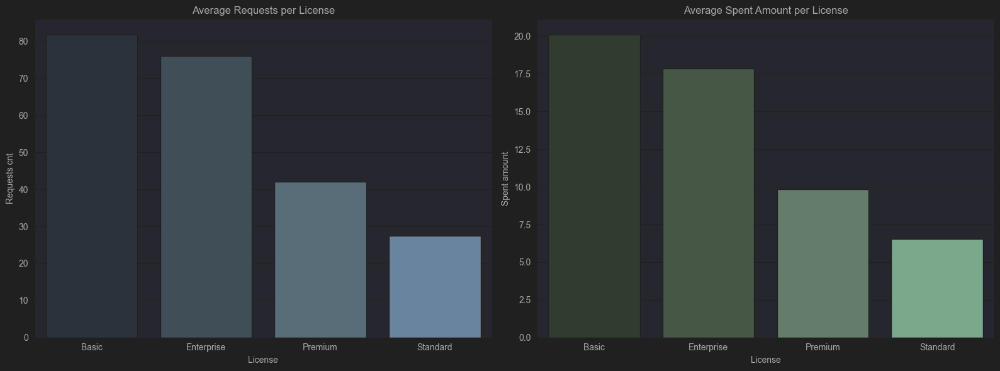

---

### Average Requests per Model

- **Model_A** has the highest average number of requests, followed closely by **Model_B** with slightly fewer requests
- **Model_C** shows a moderate level of activity
- **Model_D** has noticeably lower average activity, while **Model_E** records the lowest average

Overall, the average requests per model follow a similar pattern to total requests.

### Average Spent Amount per Model

- **Model_A** and **Model_B** lead in average spending, indicating that users of these models consistently generate the highest costs per day/user
- **Model_C**, **Model_D**, and **Model_E** show moderate to lower average spending, with **Model_E** recording the lowest value

This difference highlights that while **Model_C** has high total spending due to many users, the average spent amount is moderate, showing that individual usage intensity is lower than for **Models A and B**.

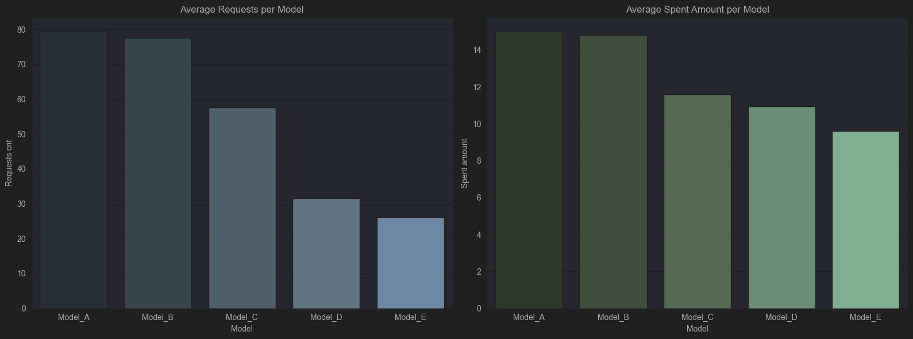

---

### Total Requests and Total Spent Amount per License

Both the total requests and total spent amount distributions show a very similar pattern across license types:
**Basic** > **Enterprise** > **Premium** > **Standard**

This order highlights a strong pattern in user behaviour:
- **Basic** license users have the highest request volume and total spending, indicating that this type has the largest and most active user base
- **Enterprise** license users also show high activity and spending, slightly below Basic
- **Premium** users follow with moderately high usage
- **Standart** users show the lowest request volume and total spending (roughly half of **Basic**), suggesting that **Standard** is the smallest or least active group of users

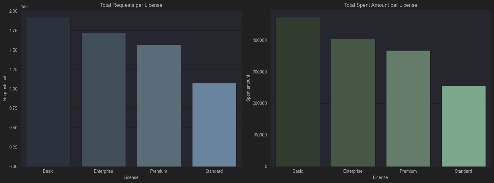

---

### Average Requests and Average Spent Amount per License

When examining totals, **Premium** still showed relatively high usage, and **Standard** was moderate.

   - **Basic** has the highest average requests and spending.
   - **Enterprise** comes next, slightly lower than Basic.
   - **Premium** now sits at a moderate level.
   - **Standard** records the lowest averages for both requests and spent amount.

This indicates that while total activity may be influenced by the number of users in each license category, the average requests and spent amount provide a slightly clearer view of individual usage intensity. It shows that Basic and Enterprise users are the most active, whereas Standard users engage less with the IDE features on average.


---

### Total Requests and Total Spent Amount per Feature

The distribution of total requests and spending across features shows a clear descending pattern: **Feature_1** > **Feature_2** > **Feature_3** > **Feature_4** > **Feature_5**, with a significant drop from the top feature to the bottom.

These distributions suggest:
- **Feature_1** has the highest total requests, making it the most frequently used functionality in the IDE
- **Feature_2** and **Feature_3** follow with substantial usage, but clearly lower than Feature_1
- **Feature_4** and **Feature_5** have the lowest activity, indicating that they are used less frequently

The total spent amount mirrors this pattern, showing that higher usage features also contribute more to overall spending. The steep drop from **Feature_1** to **Feature_5** highlights that a small number of features dominate total usage and cost.


---

### Average Requests and Average Spent Amount per Feature

When looking at average requests and spent amount, the differences between features are less pronounced, and all features show high usage.

- **Feature_1** still leads in average requests and spending, but the gap between features is smaller
- **Feature_2** follows closely, indicating strong engagement across these functionalities
- **Feature_3**, **Feature_4** and **Feature_5** now show high averages rather than being minimal, suggesting that while they are less dominant in totals, they are still actively used by individual users

This demonstrates that while total usage highlights dominance by a few features, average usage reveals that all features are meaningfully engaged with, providing a fuller picture of feature utilization across the user base.

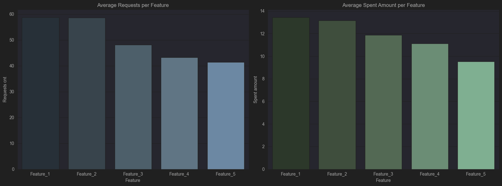

---

### Proportion-based Analysis
- Pie charts reveal that activity and spending are concentrated among a small subset of models, licenses, and features.
- Minor discrepancies between request percentages and spending percentages indicate different costs per model or feature.

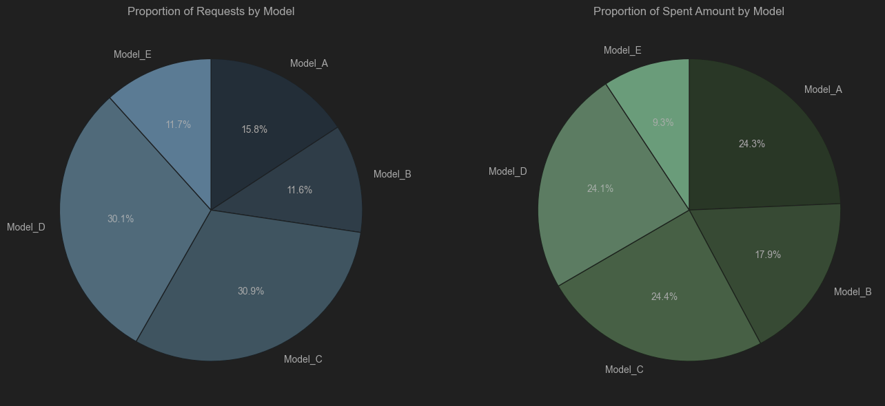

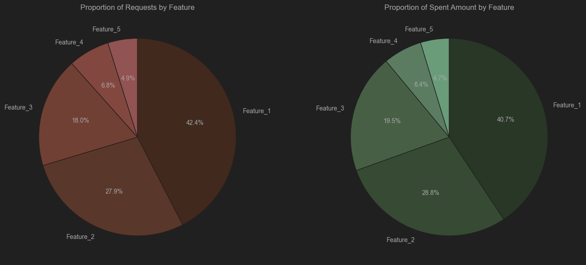

---

## Heatmaps

### Feature Usage by Model
   - **Feature_1** is used most with **Model_C** (937,253 requests), followed by **Model_D** (798,043)
   - **Feature_2** has a reversed pattern: highest usage is in **Model_D** (603,601), then **Model_C** (404,161)
   - **Feature_3** usage is also highest in **Model_C** (358,344), followed by **Model_D** (251,417)
   - **Feature_4** is repeating the same pattern: **Model_C** > **Model_D**
   - **Feature_5** is used most with **Model D**, being the only feature with more than 100,000 requests

   **Insights:**
   - Certain features are commonly used with specific models (e.g. **Feature_1** with both **Model_C** and **Model_D**)
   - **Model_C** is the most heavily used across multiple features (except **Feature_5**), while **Model_B** generally has lower usage

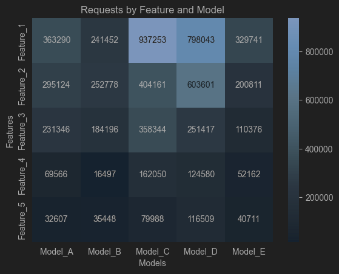

### Feature Usage by License
    
   - **Feature_1** is most used by **Enterprise** users (804,744 requests), followed by **Premium** (730,810) and **Standard** (667,640). Basic license holders use it the least (466,585)
   - **Feature_2** follows the same pattern: **Enterprise** (551,073) > **Premium** (473,730) > **Standard** (440,801) > **Basic** (290,871)
   - **Feature_3** is also mostly used by Enterprise users (354,036), with decreasing usage for Premium, Standard, and Basic
   - **Features_4** and **Feature_5** have much lower usage overall, but **Enterprise** users show slightly higher usage than other license holders

   **Insights:**
   - Enterprise and Premium users are the most active across almost all features, suggesting that higher-tier licenses drive more feature usage
   - Basic users consistently have the lowest usage, showing either limited access to features or smaller engagement
   - Feature popularity is consistent across licenses: **Feature_1** and **Feature_2** are the most used, **Feature_3** is being right in the middle, while **Feature_4** and **Feature_5** are the least popular

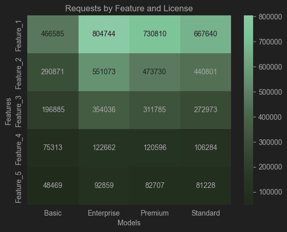

---

### Temporal Patterns
The daily data shows significant volatility, with sharp spikes and drops in both `requests_cnt` and `spent_amount`.
Most of these fluctuations correspond to workdays/weekend cycles, with weekends showing consistently lower usage.
This confirms that users predominantly engage with models and features during workdays

To verify observed usage patterns, we have compared average daily requests and spending on weekdays versus weekends:

- **Weekdays:** ~86995 requests and ~20769 credits spent
- **Weekends:** ~23607 requests and ~5590 credits spent

Weekday activity is roughly 3–4 times higher than weekend activity, confirming that users mostly engage with ML features during work hours.
Weekend usage remains noticeable but is significantly lower, suggesting professional usage drives most of the interaction and credit consumption.

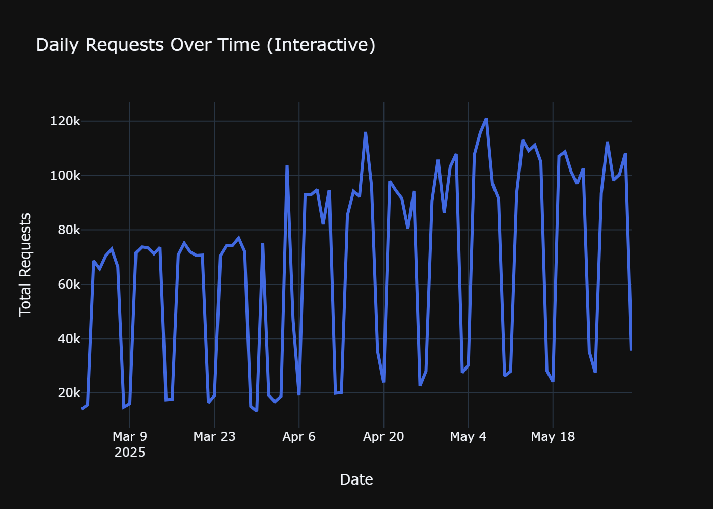
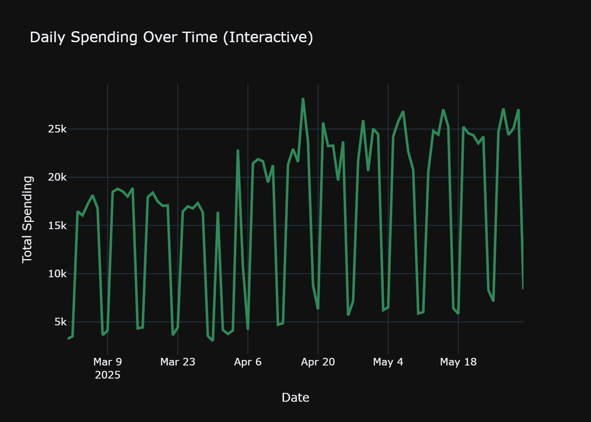

The scatter plot shows a very strong positive relationship between daily requests and spent amount.
The correlation between requests and spending is very high (**r = 0.994**), indicating a nearly perfect positive relationship: more activity corresponds to higher spending.
This suggests that active users are also the primary contributors to credit usage, highlighting a strong link between engagement and spending.

Notably, **Between March 31 and April 4**, there is a noticeable drop in both `requests_cnt` and `spent_amount`, even though this period falls on weekdays. This anomaly is evident in the scatter plot as several low blue dots, representing days when activity and spending were significantly below typical weekday levels.
Despite this short-term dip, overall weekly trends quickly rebound, showing that the drop is an isolated event rather than a persistent decline in engagement.

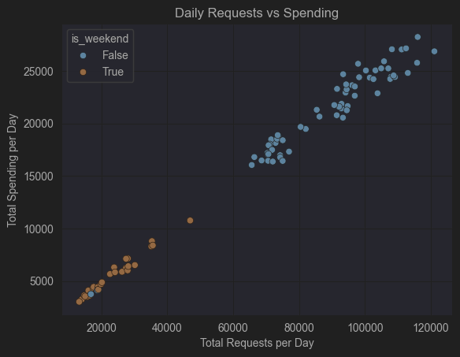

Weekly aggregation smooths daily charts and highlights a clear overall pattern.
User activity and spending steadily increase over time, indicating growing engagement with IDE ML features.
A short-term dip occurs at the beginning of April, followed by a stronger rebound that surpasses prior levels, suggesting renewed engagement.

The correlation between weekly requests and spending is **r = 0.992**, confirming once again that higher user activity closely corresponds to higher credit consumption.


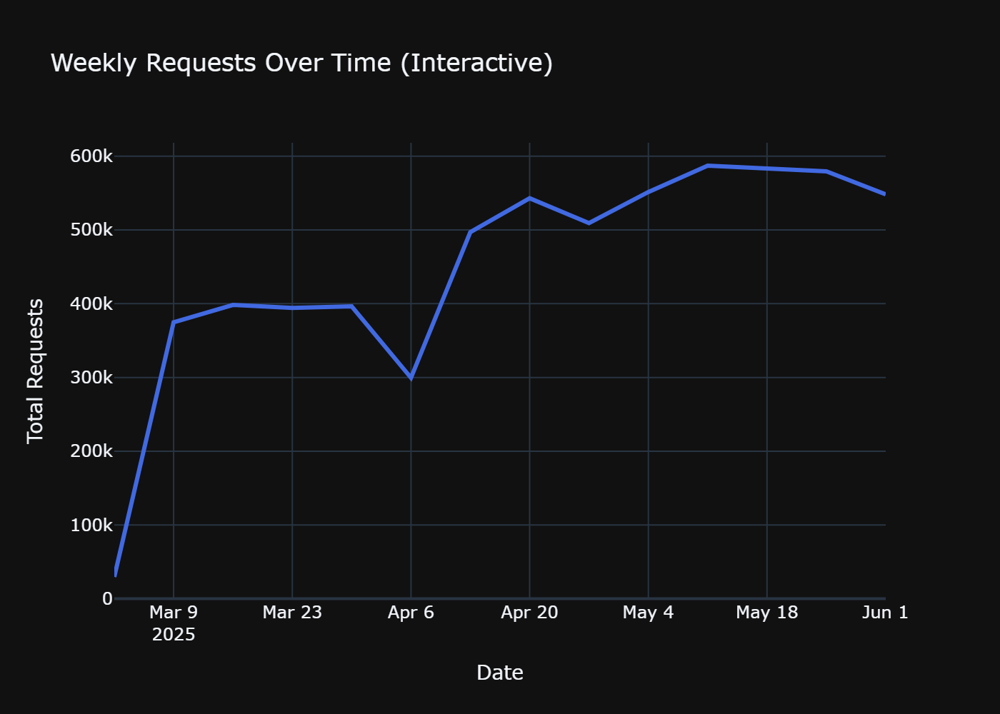
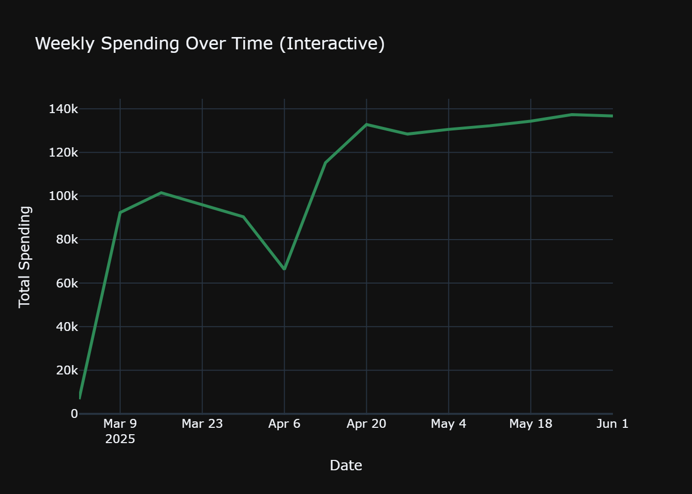

---

## Summary

### Key Findings

**Models**:

- **Model_A**, **Model_C** and **Model_D** lead in spending, while **Model_E** contributes the least
- Average requests and spending show that **Model_A** and **Model_B** users are the most initiative
- **Model_C** and **Model_D** dominate in request activity, accounting for over 60% of total requests together

**Licenses**:

- **Enterprise** and **Premium** license holders are responsible for the majority of requests and spending
- **Basic** users have high activity but lower averages, whereas **Standard** users are the least active
- Normalized usage confirms that **Enterprise** and **Premium** license holders are the most active

**Features**:

- **Feature_1** dominates both total and proportional usages (~42% of requests, ~41% of spending)
- **Feature_2** and **Feature_3** also show significant engagement of users, while **Feature_4** and **Feature_5** have minimal absolute usage.
- Average usage shows that all features are being used meaningfully, indicating no feature is entirely ignored

**Proportion-based Analysis**

- Pie charts show uneven distribution of requests and spending, highlighting that a few models, licenses and features drive the majority of activity
- Major discrepancies exist between request percentages and spending percentages, indicating differences in cost across models

**Temporal Patterns**:

- Daily user activity is highly volatile, with clear weekday/weekend patterns. Weekdays show 3-4 times higher usage than weekends
- Between March 31 and April 4, an unexpected drop occurred during the workweek, visible in both daily charts and the scatterplot
- Weekly trends indicate steady growth and high correlation between requests and spending

### Insights:

- High-tear license users are the most active: **Enterprise** and **Premium** users are both frequent and high-spending
- All features are relevant: even less-used features have meaningful user engagement, which could justify maintaining or enhancing them
- User behavior is concentrated: a small subset of models, licenses and features drive the majority of requests and credit spending
- Requests and spending are tightly linked: engagement of users and credit spending are strongly correlated, indicating that any change in usage patterns directly affects spending

### Actionable Recommendations:

- Monitor anomalies: investigate unusual dips (such as the March 31 - April 4 period) to identify any potential issues
- Optimize model usage: prioritize performance improvements, updates and support for the most popular models
- Prioritize features: maintain and enhance frequently used features, while considering improvements for less-used ones to ensure overall user satisfaction
- Plan capacity effectively: given the strong correlation between requests and spending, ensure that infrastructure scales appropriately with user growth
- Increase engagement of low-tier license users: implement initiatives to boost **Standard** and **Basic** license activity through promotions, feature highlights or targeted onboarding
---

## How to Run

1. Clone the repository
2. Install dependencies:

   ```bash
   pip install -r requirements.txt
   ```
3. Ensure the dataset is located at:

   ```
   data/da_internship_task_dataset.csv
   ```
4. Open and run the notebook:

   ```bash
   jupyter notebook ML_Features_Usage_Analysis.ipynb
   ```

---

## Future Enhancements

* Statistical testing and confidence intervals
* User segmentation and clustering
* Predictive modeling for usage and revenue forecasting
* Dashboard deployment for stakeholder consumption

---

## Author

### Yevhen Skyba
Computer Engineering Student @ Wrocław University of Science and Technology

---

## License

The MIT License
